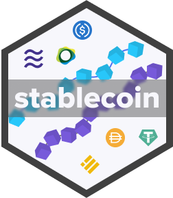

<!-- README.md is generated from README.Rmd. Please edit that file -->

```{r, include = FALSE}
knitr::opts_chunk$set(
  collapse = TRUE,
  comment = "#>",
  fig.path = "man/figures/README-",
  out.width = "100%"
)
```

# stablecoin 

<!-- badges: start -->
[](https://lifecycle.r-lib.org/articles/stages.html#experimental)
[](https://CRAN.R-project.org/package=stablecoin)
[](https://codecov.io/gh/galen211/stablecoin?branch=master)
[](https://github.com/galen211/stablecoin/actions)
<!-- badges: end -->

The goal of stablecoin is to give data analysts a way to quickly assemble and analyze data on different stablecoins that exist on public blockchains.

## Installation

You can install the released version of stablecoin from [CRAN](https://CRAN.R-project.org) with:

``` r
install.packages("stablecoin")
```

Load the package with:
```{r}
library(usdc)
```

## Basic Usage
Fetch the current circulating supply in a tibble data frame
```r
fetch_supply_usdc()
```

## Data sources used by `stablecoin`

* Current USDC in circulation on each of the officially supported blockchains is provided through the webservices listed below:
    * **Algorand**: [AlgoExplorer](https://algoexplorer.io/) explorer API service
    * **Ethereum**: [Blockchair](https://blockchair.com/) explorer API service
    * **Solana**: [Solana](https://docs.solana.com/developing/clients/jsonrpc-api) JSON RPC API
    * **Stellar**: [Stellar Foundation](https://www.stellar.org/) explorer API service
    * **TRON**: [TRON Scan](https://tronscan.org/#/) explorer API service
* Historical USDC metrics are fetched from the [Coin Metrics](https://docs.coinmetrics.io/api/v4) API

## Roadmap
Centre is developing a graphql [subgraph](https://thegraph.com/explorer/subgraph/centrehq/usdc), which may eventually expand the scope of data analysis interfaces that can be provided by this package.  Some ideas for future functionality are described on the roadmap below.

**Roadmap Items:**
 - Track each chain's historical balance of USDC
 - Add additional convenience charts and chart customizations
 - Query the Centre USDC subgraph using the Graph protocol
 - Track USDC token balances deposited in different lending and DEX protocols

## Code of Conduct
Please note that the stablecoin project is released with a [Contributor Code of Conduct](https://contributor-covenant.org/version/2/0/CODE_OF_CONDUCT.html). By contributing to this project, you agree to abide by its terms.
