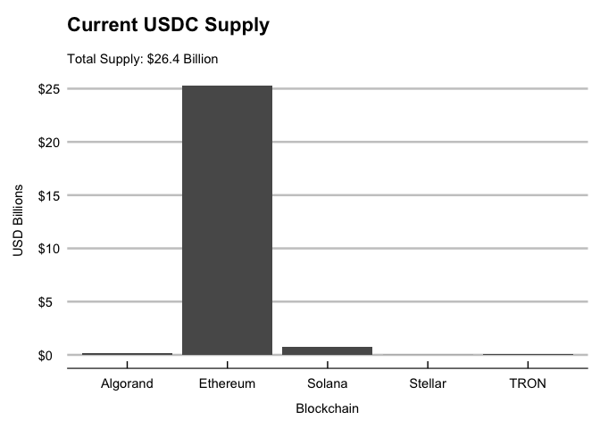
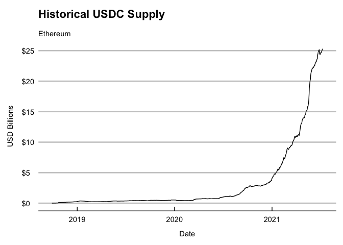

<!-- README.md is generated from README.Rmd. Please edit that file -->

# stablecoin 

<!-- badges: start -->

[](https://lifecycle.r-lib.org/articles/stages.html#experimental)
[](https://CRAN.R-project.org/package=stablecoin)
[](https://codecov.io/gh/galen211/stablecoin?branch=master)
[](https://github.com/galen211/stablecoin/actions)
<!-- badges: end -->

The goal of stablecoin is to …

## Installation

You can install the released version of stablecoin from
[CRAN](https://CRAN.R-project.org) with:

``` r
install.packages("stablecoin")
```

### Current Supply

Print the value of current circulating supply to the console

``` r
library(usdc)
print_all_chains()
```

| datetime            | chain    | token\_id                                                | circulating\_supply |
|:--------------------|:---------|:---------------------------------------------------------|:--------------------|
| 2021-07-11 13:42:50 | Ethereum | 0xa0b86991c6218b36c1d19d4a2e9eb0ce3606eb48               | $25,282,234,223     |
| 2021-07-11 13:42:50 | Algorand | 31566704                                                 | $173,753,567        |
| 2021-07-11 13:42:50 | Stellar  | GA5ZSEJYB37JRC5AVCIA5MOP4RHTM335X2KGX3IHOJAPP5RE34K4KZVN | $12,236,161         |
| 2021-07-11 13:42:50 | Solana   | EPjFWdd5AufqSSqeM2qN1xzybapC8G4wEGGkZwyTDt1v             | $785,000,020        |
| 2021-07-11 13:42:50 | TRON     | TEkxiTehnzSmSe2XqrBj4w32RUN966rdz8                       | $108,956,343        |
| datetime            | chain    | circulating\_supply                                      |                     |
| :——————-            | :——–     | :——————                                                  |                     |
| 2021-07-03 09:40:03 | Ethereum | $24,655,736,469                                          |                     |
| 2021-07-03 09:40:03 | Algorand | $176,118,855                                             |                     |
| 2021-07-03 09:40:03 | Stellar  | $11,249,153                                              |                     |
| 2021-07-03 09:40:03 | Solana   | $785,000,020                                             |                     |
| 2021-07-03 09:40:03 | TRON     | $111,745,328                                             |                     |

Fetch and store the current circulating supply in a tibble data frame

``` r
df <- fetch_supply_usdc()
```

### Historical Metrics

Fetch and store the historical supply of USDC on Ethereum in a tibble
data frame. Note that this function support Coin Metrics’ definitions
for metrics. For more information on Coin Metrics’ API see,
<https://docs.coinmetrics.io/api/v4>

``` r
df <- fetch_historical_ethereum(metric = "CapMrktCurUSD")
tail(df)
#> # A tibble: 6 x 4
#>   date              value measurement   blockchain
#>   <date>            <dbl> <chr>         <chr>     
#> 1 2021-07-05 24691353755. CapMrktCurUSD Ethereum  
#> 2 2021-07-06 24849279966. CapMrktCurUSD Ethereum  
#> 3 2021-07-07 24960290162. CapMrktCurUSD Ethereum  
#> 4 2021-07-08 25101936817. CapMrktCurUSD Ethereum  
#> 5 2021-07-09 25256597252. CapMrktCurUSD Ethereum  
#> 6 2021-07-10 25263537872. CapMrktCurUSD Ethereum
```

| date       |       value | measurement   | blockchain |
|:-----------|------------:|:--------------|:-----------|
| 2021-06-13 | 22983465371 | CapMrktCurUSD | Ethereum   |
| 2021-06-14 | 23069134166 | CapMrktCurUSD | Ethereum   |
| 2021-06-15 | 23167467437 | CapMrktCurUSD | Ethereum   |
| 2021-06-16 | 23276979355 | CapMrktCurUSD | Ethereum   |
| 2021-06-17 | 23265686419 | CapMrktCurUSD | Ethereum   |
| 2021-06-18 | 23499032393 | CapMrktCurUSD | Ethereum   |

Fetch and store the amount of daily active USDC supply on Ethereum in a
tibble data frame. Note that this function uses the Coin Metrics API
field `SplyAct1d`. Other metrics can also be substituted.

``` r
df <- fetch_historical_ethereum(metric = "SplyAct1d")
tail(df)
#> # A tibble: 6 x 4
#>   date              value measurement blockchain
#>   <date>            <dbl> <chr>       <chr>     
#> 1 2021-07-05 11592048929. SplyAct1d   Ethereum  
#> 2 2021-07-06 12065676975. SplyAct1d   Ethereum  
#> 3 2021-07-07  8927407815. SplyAct1d   Ethereum  
#> 4 2021-07-08 12032742331. SplyAct1d   Ethereum  
#> 5 2021-07-09 12192341749. SplyAct1d   Ethereum  
#> 6 2021-07-10  8962888003. SplyAct1d   Ethereum
```

| date       |       value | measurement | blockchain |
|:-----------|------------:|:------------|:-----------|
| 2021-06-13 | 11847179390 | SplyAct1d   | Ethereum   |
| 2021-06-14 | 12143159721 | SplyAct1d   | Ethereum   |
| 2021-06-15 | 12515784380 | SplyAct1d   | Ethereum   |
| 2021-06-16 |  9853525925 | SplyAct1d   | Ethereum   |
| 2021-06-17 |  9733206839 | SplyAct1d   | Ethereum   |
| 2021-06-18 |  9667080264 | SplyAct1d   | Ethereum   |

#### Coin Metrics fields

An internal dataset holds the fields which are currently available
through the Coin Metrics API. To view the dataset, simply type
`metrics`. The example below shows some of the supported fields:

``` r
library(usdc)
library(dplyr)
#> 
#> Attaching package: 'dplyr'
#> The following objects are masked from 'package:stats':
#> 
#>     filter, lag
#> The following objects are masked from 'package:base':
#> 
#>     intersect, setdiff, setequal, union
library(knitr)
metrics %>% select(id, description) %>% slice_sample(n=5) %>% kable()
```

| id               | description                                                                                                                                                                                                                                                                                                                                                                                                 |
|:-----------------|:------------------------------------------------------------------------------------------------------------------------------------------------------------------------------------------------------------------------------------------------------------------------------------------------------------------------------------------------------------------------------------------------------------|
| DiffLast         | The difficulty of the last block in the interval. Difficulty represents how hard it is to find a hash that meets the protocol-designated requirement (i.e., the difficulty of finding a new block) that day. The requirement is unique to each applicable cryptocurrency protocol. Difficulty is adjusted periodically by the protocol as a function of how much hashing power is being deployed by miners. |
| SplyAct5yr       | The sum of unique native units that transacted at least once in the trailing 5 years up to the end of that interval. Native units that transacted more than once are only counted once.                                                                                                                                                                                                                     |
| AdrBalNtv100KCnt | The sum count of unique addresses holding at least 100,000 native units as of the end of that interval. Only native units are considered (e.g., an address with less than X ETH but with more than X in ERC-20 tokens would not be considered).                                                                                                                                                             |
| FlowOutExNtv     | The sum in native units withdrawn from exchanges that interval, excluding exchange to exchange activity.                                                                                                                                                                                                                                                                                                    |
| PriceBTC         | The fixed closing price of the asset as of 00:00 UTC the following day (i.e., midnight UTC of the current day) for end-of-day data or the closest prior hour (nearest to that block) for block-by-block data, denominated in BTC.                                                                                                                                                                           |
| id               | description                                                                                                                                                                                                                                                                                                                                                                                                 |
| :—————           | :———————————————————————————————————————————————————————————————————————————————————————————————                                                                                                                                                                                                                                                                                                            |
| AdrBal1in10MCnt  | The sum count of unique addresses holding at least one ten-millionth ownership of the current supply of native units as of the end of that interval. Only native units are considered (e.g., an address with less than one ten-millionth ETH but with ERC-20 tokens would not be considered).                                                                                                               |
| FeeByteMeanNtv   | The mean transaction fee per byte of all blocks that interval in native units.                                                                                                                                                                                                                                                                                                                              |
| SplyAdrBalUSD1   | The sum of all native units being held in addresses whose balance was $1 or greater at the end of that interval. Only native units are considered (e.g., an address with less than X ETH but with more than X in ERC-20 tokens would not be considered).                                                                                                                                                    |
| BlkSizeMeanByte  | The mean size (in bytes) of all blocks created that day.                                                                                                                                                                                                                                                                                                                                                    |
| FeeTotUSD        | The sum USD value of all fees paid to miners that interval. Fees do not include new issuance.                                                                                                                                                                                                                                                                                                               |

### Plotting

Plot the current supply of USDC on each supported blockchain


Plot the current supply of USDC on Ethereum


## Data sources used by `usdc`

-   Current USDC in circulation on each of the officially supported
    blockchains is provided through the webservices listed below:
    -   **Algorand**: [AlgoExplorer](https://algoexplorer.io/) explorer
        API service
    -   **Ethereum**: [Blockchair](https://blockchair.com/) explorer API
        service
    -   **Solana**:
        [Solana](https://docs.solana.com/developing/clients/jsonrpc-api)
        JSON RPC API
    -   **Stellar**: [Stellar Foundation](https://www.stellar.org/)
        explorer API service
    -   **TRON**: [TRON Scan](https://tronscan.org/#/) explorer API
        service
-   Historical USDC metrics are fetched from the [Coin
    Metrics](https://docs.coinmetrics.io/api/v4) API

## Roadmap

Centre is developing a graphql
[subgraph](https://thegraph.com/explorer/subgraph/centrehq/usdc), which
may eventually expand the scope of data analysis interfaces that can be
provided by this package. Some ideas for future functionality are
described on the roadmap below.

**Roadmap Items:** - Track each chain’s historical balance of USDC - Add
additional convenience charts and chart customizations - Query the
Centre USDC subgraph using the Graph protocol - Track USDC token
balances deposited in different lending and DEX protocols

## Example

This is a basic example which shows you how to solve a common problem:

``` r
library(stablecoin)
## basic example code
```

What is special about using `README.Rmd` instead of just `README.md`?
You can include R chunks like so:

``` r
summary(cars)
#>      speed           dist       
#>  Min.   : 4.0   Min.   :  2.00  
#>  1st Qu.:12.0   1st Qu.: 26.00  
#>  Median :15.0   Median : 36.00  
#>  Mean   :15.4   Mean   : 42.98  
#>  3rd Qu.:19.0   3rd Qu.: 56.00  
#>  Max.   :25.0   Max.   :120.00
```

You’ll still need to render `README.Rmd` regularly, to keep `README.md`
up-to-date. `devtools::build_readme()` is handy for this. You could also
use GitHub Actions to re-render `README.Rmd` every time you push. An
example workflow can be found here:
<https://github.com/r-lib/actions/tree/master/examples>.

You can also embed plots, for example:


In that case, don’t forget to commit and push the resulting figure
files, so they display on GitHub and CRAN.

## Code of Conduct

Please note that the stablecoin project is released with a [Contributor
Code of
Conduct](https://contributor-covenant.org/version/2/0/CODE_OF_CONDUCT.html).
By contributing to this project, you agree to abide by its terms.
